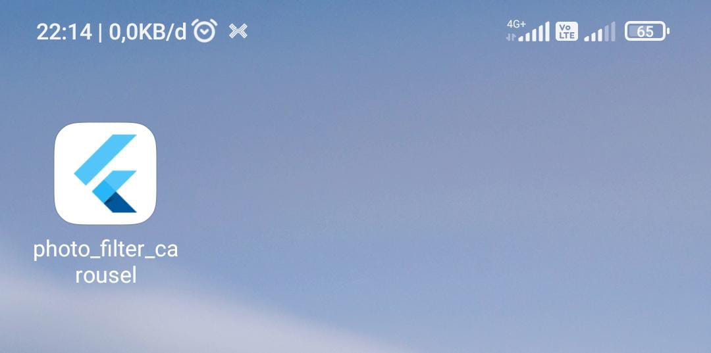

# Praktikum 2 : aplikasi filter menggunakan flutter

## Deskripsi
Aplikasi ini merupakan implementasi filter pada Flutter yang bisa mengganti ganti warna filter.

## Screenshot Hasil

## Screenshot running

## Penjelasan
1. menambahkan filter pada gambar
2. bisa memilih filter
3. filter berupa slider
